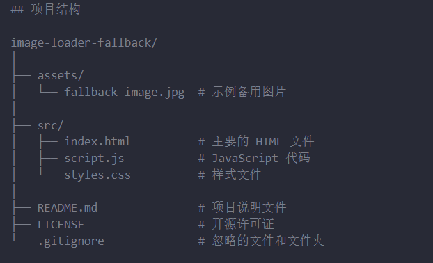

# randomImage

## 介绍
这个项目提供了一个简单的前端应用，用于展示从指定图片列表中随机选择的图片。当图片加载失败时，会自动显示备用图片，并记录加载错误的日志。

## 项目结构

│image-loader-fallback/
├── assets/                 
│   └── fallback-image.jpg  # 示例备用图片
│
├── src/                    
│   ├── index.html          # 主要的 HTML 文件
│   ├── script.js           # JavaScript 代码
│   └── styles.css          # 样式文件
│
├── README.md               # 项目说明文件
├── LICENSE                 # 开源许可证
└── .gitignore              # 忽略的文件和文件夹

## 功能

- 自动从指定的图片链接列表中选择一张图片加载。
- 如果图片加载失败，自动显示备用图片。
- 支持自定义备用图片和错误日志记录。

## 如何运行和贡献：

### 安装和运行：
   - 将整个项目下载或克隆到本地，打开 `src/index.html` 即可在浏览器中查看效果。
   - 如果需要更改备用图片路径，修改 `src/script.js` 中的 `fallbackImageUrl` 配置。

### 参与贡献

1.  Fork 本仓库
2.  新建 Feat_xxx 分支
3.  提交代码
4.  新建 Pull Request

